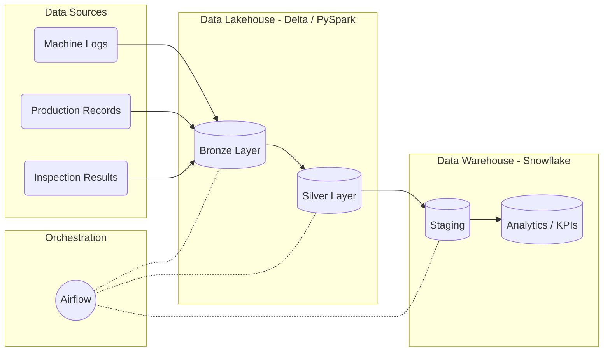

# Manufacturing Quality and Operations Lakehouse


## Overview
An end-to-end data lakehouse pipeline for the manufacturing domain that ingests machine, production, and inspection data. It transforms raw operational data using PySpark (simulating a Databricks environment), loads trusted datasets into Snowflake, and computes key manufacturing performance indicators (KPIs) like defect rates, throughput, machine downtime, and material-batch quality trends.

GitHub: [https://github.com/huzaifajsr/Manufacturing-Quality-Operations-Lakehouse](https://github.com/huzaifajsr/Manufacturing-Quality-Operations-Lakehouse)

## Architecture



## Project Structure
```text
.
├── config/
│   └── pipeline_config.yaml         # Pipeline configurations
├── dags/
│   └── manufacturing_pipeline_dag.py # Airflow DAG orchestration
├── data/
│   └── generate_sample_data.py      # Script to generate sample data
├── data_quality/
│   └── checks.py                    # Data quality framework functions
├── spark_jobs/
│   ├── ingest_raw.py                # Bronze layer ingestion
│   ├── transform_quality.py         # Silver layer quality transformations
│   ├── transform_downtime.py        # Silver layer downtime transformations
│   └── load_to_snowflake.py         # Snowflake loader
├── sql/
│   ├── snowflake_setup.sql          # Snowflake DDL
│   ├── kpi_defect_rate.sql          # KPI: Defect Rate
│   ├── kpi_throughput.sql           # KPI: Throughput
│   ├── kpi_downtime.sql             # KPI: Downtime
│   └── kpi_material_batch.sql       # KPI: Material Batch Trends
├── docker-compose.yml               # Local Airflow deployment
├── Dockerfile                       # Custom Airflow image with PySpark/Snowflake
└── requirements.txt                 # Python dependencies
```

## Setup Instructions

1. **Docker Setup (Airflow)**
   Run the following commands to initialize and start the Airflow cluster:
   ```bash
   docker-compose build
   docker-compose up airflow-init
   docker-compose up -d
   ```
2. **Databricks / PySpark**
   Jobs are written in standard PySpark and can be deployed directly to Databricks using the Databricks CLI or Asset Bundles. For local testing, they run via a local SparkSession.
3. **Snowflake**
   Execute `sql/snowflake_setup.sql` in your Snowflake instance to create the necessary databases, schemas, and tables. Update `config/pipeline_config.yaml` with your Snowflake credentials.

## Data Model & KPIs
* **Defect Rate**: `defect_count / total_inspected * 100` (computed per line/shift/category). Includes 7-day rolling average.
* **Throughput**: Units produced per hour per line per shift, including shift-over-shift change %.
* **Downtime & Availability**: Machine availability % based on `(shift_duration - downtime) / shift_duration`.
* **Material Batch Trends**: Defect rate mapped by material supplier with trend analysis using LAG over past supplier batches.
